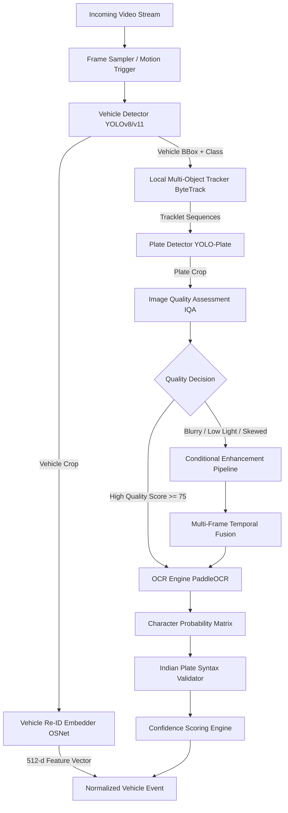

# TRACE-X: AI Models & Computer Vision Pipeline Specification

**Document Code:** AI-SPEC-01  
**Architecture Version:** 2.0  
**Target Accuracy:** $\ge 90\%$ ANPR/OCR in Adverse Conditions  
**Primary Models:** YOLOv8/v11, PaddleOCR/CRNN, OSNet (Vehicle Re-ID), OpenCV IQA  

---

## 1. High-Level Perception Architecture

The perception pipeline is built around an evidence-preserving, confidence-aware lifecycle. Rather than passing raw video indiscriminately to heavy deep learning models, TRACE-X processes streams hierarchically to maximize throughput and robustness.



---

## 2. Module Specifications

### 2.1 Vehicle Detection & Classification (Module 3)
- **Model Architecture:** YOLOv8n / YOLOv8s (or YOLO11n for optimized edge inference) trained on MS COCO and fine-tuned on Indian traffic datasets.
- **Classes Detected:**
  - `car` (sedan, hatchback, SUV, taxi)
  - `motorcycle` (scooter, motorbike)
  - `bus` (transit bus, school bus, coach)
  - `truck` (light commercial vehicle, multi-axle cargo truck)
  - `auto_rickshaw` (three-wheeler)
- **Input Resolution:** $640 \times 640$ pixels.
- **Inference Speed:** $\sim 12 \text{ ms}$ on NVIDIA RTX 3060 / T4; $\sim 35 \text{ ms}$ on 8-core CPU (OpenVINO / ONNX Runtime).
- **Local Tracker:** ByteTrack associating detections across consecutive frames to generate local tracklet IDs ($ID_{local}$).

### 2.2 License Plate Localization (Module 4)
- **Model Architecture:** Lightweight custom YOLOv8-nano fine-tuned exclusively on high-angle, dirty, and Indian standard/HSRP (High Security Registration Plates) license plates.
- **Output:** Bounding box $[x_1, y_1, x_2, y_2]$ with a $10\%$ outward contextual padding to guarantee boundary characters are not clipped.
- **Orientation Estimation:** Identifies 4 plate corner points $[(x_1, y_1), (x_2, y_2), (x_3, y_3), (x_4, y_4)]$ for homography rectification if skew exceeds $12^\circ$.

---

## 3. Image Quality Assessment (IQA) & Pre-Screening (Module 11)

Every cropped plate undergoes instant computational screening before OCR invocation:

```python
def assess_image_quality(plate_crop: np.ndarray) -> dict:
    gray = cv2.cvtColor(plate_crop, cv2.COLOR_BGR2GRAY)
    
    # 1. Blur Metric (Variance of Laplacian)
    laplacian_var = cv2.Laplacian(gray, cv2.CV_64F).var()
    blur_score = np.clip(laplacian_var / 300.0, 0.0, 1.0)
    
    # 2. Brightness & Contrast
    mean_intensity = np.mean(gray)
    contrast_std = np.std(gray)
    brightness_score = 1.0 - abs(mean_intensity - 128) / 128.0
    contrast_score = np.clip(contrast_std / 64.0, 0.0, 1.0)
    
    # 3. Geometric Resolution
    h, w = plate_crop.shape[:2]
    resolution_score = np.clip((w * h) / (120.0 * 40.0), 0.0, 1.0)
    
    overall_quality = (0.35 * blur_score + 
                       0.25 * contrast_score + 
                       0.20 * brightness_score + 
                       0.20 * resolution_score) * 100.0
                       
    return {
        "overall_quality": round(overall_quality, 1),
        "blur_score": round(blur_score, 2),
        "contrast_score": round(contrast_score, 2),
        "brightness_mean": round(float(mean_intensity), 1),
        "resolution": (w, h),
        "needs_enhancement": overall_quality < 70.0
    }
```

---

## 4. Conditional Image Enhancement (Module 12)

Enhancement is applied **conditionally** based on diagnosed defects to avoid adding latency or artifacts to clean images:

| Diagnosed Defect | Trigger Threshold | Enhancement Technique |
| :--- | :--- | :--- |
| **Low Light / Night** | Mean intensity $< 65$ | **CLAHE** (Contrast Limited Adaptive Histogram Equalization: clip limit $3.0$, grid $8 \times 8$) + Bilateral Filtering to preserve edges while suppressing noise. |
| **Motion Blur** | Laplacian variance $< 80$ | **Wiener Deconvolution** or Lucy-Richardson deblurring with estimated point spread function (PSF). |
| **Perspective Angle** | Quad angle skew $> 15^\circ$ | **Perspective Homography Warp** to transform the quadrilateral crop into a normalized canonical rectangle ($240 \times 80 \text{ px}$). |
| **Low Resolution** | Plate height $< 25 \text{ px}$ | **Bicubic Interpolation + Unsharp Masking** (or lightweight Real-ESRGAN-Compact for high-priority streams). |
| **Headlight / Rain Glare**| Saturated pixels $> 20\%$ | **Adaptive Thresholding** + morphological opening to isolate retroreflective character contours. |

---

## 5. Multi-Frame Temporal OCR Fusion (Module 13)

Vehicles in traffic pass across a camera's field of view over $10 - 60$ frames. Rather than relying on a single snapshot where a character might be obscured by a water droplet or headlight flash, TRACE-X uses a **Multi-Frame Character Probability Fusion** algorithm:

### Fusion Algorithm
1. Extract candidate plate crops from $K$ consecutive frames ($K \in [3, 8]$) associated with the same local tracking ID.
2. For each frame $k \in \{1, \dots, K\}$, obtain the character probability distribution matrix $P^{(k)}_{i, c}$, representing the probability of character class $c \in \Sigma$ at position $i$.
3. Weight each frame by its evaluated Image Quality Score $Q_k$:
   $$\bar{P}_{i, c} = \frac{\sum_{k=1}^K Q_k \cdot P^{(k)}_{i, c}}{\sum_{k=1}^K Q_k}$$
4. Choose the optimal character at each index:
   $$\hat{c}_i = \arg\max_{c \in \Sigma} \bar{P}_{i, c}$$
5. Compute character-level confidence $C_i = \max_{c} \bar{P}_{i, c}$ and overall plate confidence:
   $$Confidence_{plate} = \frac{1}{N} \sum_{i=1}^N C_i$$

```text
Frame 1 (Q=0.62): T  S  0  9  A  [?] 1  2  3  4  (conf: 0.65)
Frame 2 (Q=0.88): T  S  0  9  A   B  1  2  3  4  (conf: 0.94)
Frame 3 (Q=0.75): T  S  0  9  A   B  1  2  [?] 4  (conf: 0.78)
----------------------------------------------------------------
Fused Consensus:  T  S  0  9  A   B  1  2  3  4  (conf: 0.96) -> CONFIRMED
```

---

## 6. Indian License Plate Syntax & Format Validation (Module 14)

Standard Indian registration plates follow the Motor Vehicles Act specification:
$$\underbrace{\text{[A-Z]\{2\}}}_{\text{State (e.g. TS, DL, MH)}} \quad \underbrace{\text{[0-9]\{2\}}}_{\text{RTO District}} \quad \underbrace{\text{[A-Z]\{1,3\}}}_{\text{Series}} \quad \underbrace{\text{[0-9]\{4\}}}_{\text{Unique Number}}$$

- **Syntax Sanitization Rules:**
  - If position 1-2 contains digits, map common OCR confusions: `0` $\to$ `O`, `8` $\to$ `B`, `1` $\to$ `I`.
  - If position 3-4 contains characters, map `O` $\to$ `0`, `B` $\to$ `8`, `I` $\to$ `1`, `Z` $\to$ `2`.
  - If length is 9 or 10 characters, validate against state code dictionary (TS, AP, KA, MH, DL, etc.).
- **Evidence Rule:** Never invent missing characters. If a character cannot be resolved with $> 0.50$ confidence after multi-frame fusion, mark as `?` (e.g., `TS09A?1234`) and assign `PARTIAL` status.

---

## 7. Vehicle Re-Identification (Re-ID) Engine (Module 25)

When a license plate is occluded, missing, or obscured, TRACE-X falls back to deep visual metric learning.

- **Backbone Architecture:** Omni-Scale Network (**OSNet-AIN**) or **ResNet50-IBN** trained on the VeRi-776 and VehicleID benchmarks.
- **Output:** L2-normalized 512-dimensional visual embedding vector:
  $$\mathbf{e} \in \mathbb{R}^{512}, \quad \|\mathbf{e}\|_2 = 1$$
- **Distance Metric:** Cosine similarity:
  $$Sim_{ReID}(\mathbf{e}_1, \mathbf{e}_2) = \frac{\mathbf{e}_1 \cdot \mathbf{e}_2}{\|\mathbf{e}_1\|_2 \|\mathbf{e}_2\|_2} = \mathbf{e}_1^\top \mathbf{e}_2$$
- **Role in Trajectory:** Re-ID acts as a strong Bayesian prior. It does not replace a confirmed plate match, but enables connecting observations when plates are partially readable or dirty.

---

## 8. Cross-Camera Evidence Fusion Model (Module 18)

When matching an observation at Camera $A$ (time $t_A$) with a candidate observation at Camera $B$ (time $t_B$ with $t_B > t_A$):

$$\text{MatchScore}(A, B) = \sum_{m=1}^6 w_m \cdot S_m(A, B)$$

| Component | Metric $S_m$ | Computation | Default Weight $w_m$ |
| :--- | :--- | :--- | :--- |
| **Plate Text Similarity** | $S_{plate}$ | Normalized Levenshtein distance: $1 - \frac{\text{Lev}(P_A, P_B)}{\max(|P_A|, |P_B|)}$ | $0.40$ |
| **Visual Re-ID Embedding**| $S_{reid}$ | Cosine similarity: $\max(0, \mathbf{e}_A^\top \mathbf{e}_B)$ | $0.25$ |
| **Vehicle Class & Color** | $S_{attr}$ | $1.0$ if class & color match, $0.5$ if color subtle variance, $0.0$ if class mismatch | $0.10$ |
| **Travel Time Feasibility**| $S_{time}$ | Gaussian feasibility curve based on minimum and maximum realistic transit speeds | $0.10$ |
| **Road Connectivity** | $S_{road}$ | Shortest path topological reachability in the city road graph | $0.10$ |
| **Direction Consistency** | $S_{dir}$ | Angle alignment between vehicle heading and road vector | $0.05$ |

### Physical Impossibility Pruning
If implied velocity $v = \frac{\text{Distance}(A, B)}{t_B - t_A} > 160 \text{ km/h}$ or $t_B - t_A < 0$, the candidate is instantly pruned ($\text{MatchScore} = 0$), preventing false connections across distant parts of the city.

---

## 9. Fallback & Confidence Classification Hierarchy (Module 15 & 22)

```text
Level 1: Multi-Frame Temporal Fusion
   ↓ (If plate confidence >= 0.85)
   ===> STATUS: CONFIRMED (High certainty plate read)

Level 2: Crop Re-centering & Image Enhancement
   ↓ (If plate confidence between 0.50 and 0.84)
   ===> STATUS: PROBABLE (Partial plate + Re-ID + Spatiotemporal match)

Level 3: Visual Attribute & Re-ID Matching
   ↓ (If plate is completely unreadable or missing)
   ===> STATUS: RE-ID CANDIDATE (No plate claim, visual match only)

Level 4: Cross-Camera Road Graph Gap Bridging
   ↓ (Camera along expected corridor is offline)
   ===> STATUS: CAMERA GAP (Probable continuation, no phantom detection)

Level 5: Evidence Insufficient
   ↓ (MatchScore < 0.45 or conflicting attributes)
   ===> STATUS: UNKNOWN / BREAK TRAJECTORY (Zero false alerts)
```
