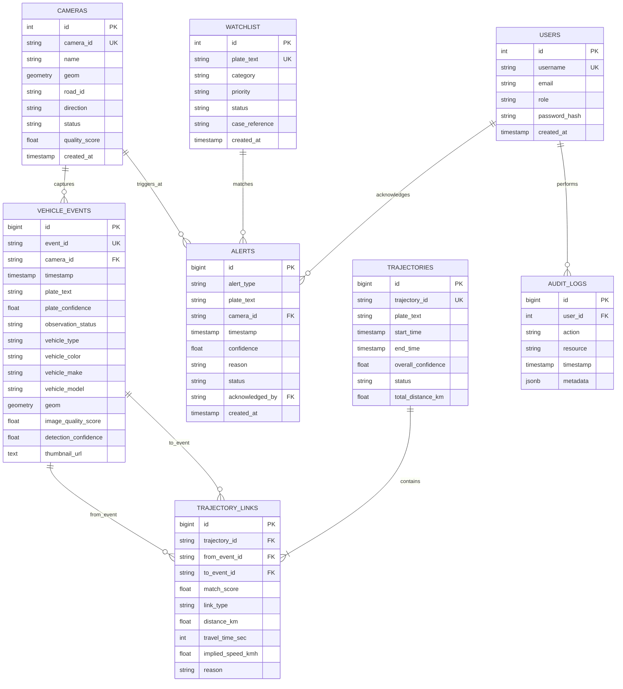

# TRACE-X: Database Schema & PostGIS Spatial Architecture

**Document Code:** DB-SPEC-01  
**Engine:** PostgreSQL 16.x  
**Extensions Required:** `postgis`, `pgcrypto`, `btree_gist`  
**Spatial Reference System:** WGS 84 (SRID 4326 / 3857 for metric distances)  

---

## 1. Entity-Relationship (ER) Overview

---

## 2. Table Specifications & Indexes

### 2.1 `cameras`
Stores physical camera nodes, mounting orientations, and operational health.
- `id`: `SERIAL PRIMARY KEY`
- `camera_id`: `VARCHAR(32) UNIQUE NOT NULL` (e.g., `C101`)
- `name`: `VARCHAR(128) NOT NULL`
- `latitude`: `DOUBLE PRECISION NOT NULL`
- `longitude`: `DOUBLE PRECISION NOT NULL`
- `geom`: `geometry(Point, 4326) GENERATED ALWAYS AS (ST_SetSRID(ST_MakePoint(longitude, latitude), 4326)) STORED`
- `road_id`: `VARCHAR(64)`
- `direction`: `VARCHAR(32)` (`north`, `south`, `east`, `west`)
- `camera_type`: `VARCHAR(32) DEFAULT 'ANPR'`
- `status`: `VARCHAR(16) DEFAULT 'online'` (`online`, `offline`, `degraded`)
- `quality_score`: `FLOAT DEFAULT 1.0`
- `created_at`: `TIMESTAMP WITH TIME ZONE DEFAULT CURRENT_TIMESTAMP`
- **Spatial Index:** `CREATE INDEX idx_cameras_geom ON cameras USING GIST (geom);`

---

### 2.2 `vehicle_events`
Stores normalized observations from perception inference.
- `id`: `BIGSERIAL PRIMARY KEY`
- `event_id`: `VARCHAR(64) UNIQUE NOT NULL`
- `camera_id`: `VARCHAR(32) REFERENCES cameras(camera_id)`
- `timestamp`: `TIMESTAMP WITH TIME ZONE NOT NULL`
- `plate_text`: `VARCHAR(16)` (Nullable if unreadable)
- `plate_confidence`: `FLOAT` (0.0 to 1.0)
- `observation_status`: `VARCHAR(16) NOT NULL` (`CONFIRMED`, `PROBABLE`, `UNREADABLE`)
- `vehicle_type`: `VARCHAR(32)` (`car`, `motorcycle`, `bus`, `truck`, `auto_rickshaw`)
- `vehicle_color`: `VARCHAR(32)`
- `vehicle_make`: `VARCHAR(64)`
- `vehicle_model`: `VARCHAR(64)`
- `direction`: `VARCHAR(32)`
- `latitude`: `DOUBLE PRECISION NOT NULL`
- `longitude`: `DOUBLE PRECISION NOT NULL`
- `geom`: `geometry(Point, 4326) GENERATED ALWAYS AS (ST_SetSRID(ST_MakePoint(longitude, latitude), 4326)) STORED`
- `image_quality_score`: `FLOAT` (0 to 100)
- `detection_confidence`: `FLOAT` (0.0 to 1.0)
- `thumbnail_url`: `TEXT`
- `created_at`: `TIMESTAMP WITH TIME ZONE DEFAULT CURRENT_TIMESTAMP`
- **Indexes:**
  - `CREATE INDEX idx_events_plate ON vehicle_events(plate_text);`
  - `CREATE INDEX idx_events_timestamp ON vehicle_events(timestamp DESC);`
  - `CREATE INDEX idx_events_camera_time ON vehicle_events(camera_id, timestamp DESC);`
  - `CREATE INDEX idx_events_geom ON vehicle_events USING GIST (geom);`

---

### 2.3 `trajectories`
Header record for a reconstructed vehicle journey.
- `id`: `BIGSERIAL PRIMARY KEY`
- `trajectory_id`: `VARCHAR(64) UNIQUE NOT NULL`
- `plate_text`: `VARCHAR(16) NOT NULL`
- `start_time`: `TIMESTAMP WITH TIME ZONE NOT NULL`
- `end_time`: `TIMESTAMP WITH TIME ZONE NOT NULL`
- `overall_confidence`: `FLOAT NOT NULL`
- `status`: `VARCHAR(16) DEFAULT 'CONFIRMED'` (`CONFIRMED`, `PROBABLE`, `INCOMPLETE`)
- `total_distance_km`: `FLOAT DEFAULT 0.0`
- `created_at`: `TIMESTAMP WITH TIME ZONE DEFAULT CURRENT_TIMESTAMP`

---

### 2.4 `trajectory_links`
Graph edges representing connected travel legs between sequential camera events.
- `id`: `BIGSERIAL PRIMARY KEY`
- `trajectory_id`: `VARCHAR(64) REFERENCES trajectories(trajectory_id) ON DELETE CASCADE`
- `from_event_id`: `VARCHAR(64) REFERENCES vehicle_events(event_id)`
- `to_event_id`: `VARCHAR(64) REFERENCES vehicle_events(event_id)`
- `match_score`: `FLOAT NOT NULL`
- `link_type`: `VARCHAR(16) NOT NULL` (`CONFIRMED`, `PROBABLE`, `CAMERA_GAP`)
- `distance_km`: `FLOAT NOT NULL`
- `travel_time_sec`: `INTEGER NOT NULL`
- `implied_speed_kmh`: `FLOAT NOT NULL`
- `reason`: `TEXT`
- **Indexes:**
  - `CREATE INDEX idx_links_trajectory ON trajectory_links(trajectory_id);`

---

### 2.5 `watchlist`
High-interest target vehicles for active monitoring and automated alerts.
- `id`: `SERIAL PRIMARY KEY`
- `plate_text`: `VARCHAR(16) UNIQUE NOT NULL`
- `category`: `VARCHAR(32) NOT NULL` (`STOLEN`, `SUSPECT`, `VIP`, `TRAFFIC_VIOLATOR`)
- `priority`: `VARCHAR(16) DEFAULT 'HIGH'` (`CRITICAL`, `HIGH`, `MEDIUM`)
- `case_reference`: `VARCHAR(64)`
- `status`: `VARCHAR(16) DEFAULT 'ACTIVE'` (`ACTIVE`, `INACTIVE`, `ARCHIVED`)
- `created_at`: `TIMESTAMP WITH TIME ZONE DEFAULT CURRENT_TIMESTAMP`

---

### 2.6 `alerts`
Real-time operational alerts generated by the intelligence engine.
- `id`: `BIGSERIAL PRIMARY KEY`
- `alert_type`: `VARCHAR(32) NOT NULL` (`WATCHLIST_MATCH`, `ROUTE_ANOMALY`, `CLONED_PLATE`, `CONGESTION`)
- `plate_text`: `VARCHAR(16)`
- `camera_id`: `VARCHAR(32) REFERENCES cameras(camera_id)`
- `timestamp`: `TIMESTAMP WITH TIME ZONE NOT NULL`
- `confidence`: `FLOAT NOT NULL`
- `reason`: `TEXT NOT NULL`
- `status`: `VARCHAR(16) DEFAULT 'NEW'` (`NEW`, `ACKNOWLEDGED`, `DISMISSED`, `RESOLVED`)
- `acknowledged_by`: `VARCHAR(64)`
- `created_at`: `TIMESTAMP WITH TIME ZONE DEFAULT CURRENT_TIMESTAMP`

---

### 2.7 `users` & `audit_logs`
Role-based security and legally admissible audit logs.
- `users`: `id`, `username`, `email`, `role` (`ADMIN`, `OFFICER`, `ANALYST`), `password_hash`, `created_at`
- `audit_logs`: `id`, `user_id`, `action` (`SEARCH_PLATE`, `EXPORT_REPORT`, `ACK_ALERT`), `resource`, `timestamp`, `metadata` (JSONB)
