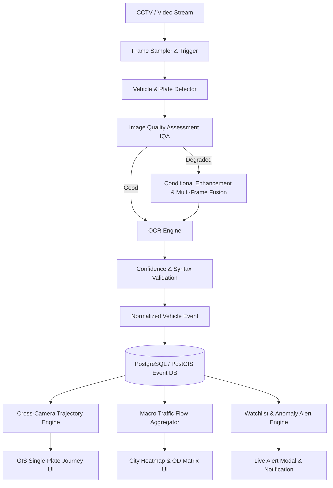

# TRACE-X: Product Requirements Document (PRD)

**Project Code:** SIH26127  
**Project Title:** City-Wide AI Engine for Multi-Camera ANPR Trajectory Tracking and Urban Traffic Analytics  
**Platform Name:** TRACE-X (Traffic Reconnaissance & Analytics Camera Engine - eXpert)  
**Target Event:** Smart India Hackathon (SIH) 2026  
**Document Version:** 1.0.0  
**Status:** Approved for Implementation  

---

## 1. Executive Summary & Vision

TRACE-X is an enterprise-grade AI intelligence layer designed to sit atop existing municipal CCTV and ANPR (Automatic Number Plate Recognition) camera infrastructure. Modern urban command centers deploy thousands of geographically dispersed cameras; however, these feeds remain isolated operational silos. Law enforcement and traffic authorities cannot easily reconstruct the continuous path of a suspect vehicle across jurisdictional sectors, nor can urban planners derive actionable macro-level flow analytics from raw footage.

TRACE-X bridges this gap through a unified operational paradigm:
$$\textbf{See} \longrightarrow \textbf{Connect} \longrightarrow \textbf{Understand} \longrightarrow \textbf{Act}$$

- **See:** Robustly extract vehicle and license plate data even under degraded conditions (rain, low light, glare, steep angles, motion blur, partial occlusion).
- **Connect:** Reconstruct cross-camera vehicle trajectories over space and time, fusing plate similarity, visual appearance embeddings (Re-ID), road network connectivity, and travel-time feasibility.
- **Understand:** Aggregate millions of discrete vehicle events into macro-level urban traffic intelligence (density heatmaps, hourly flows, Origin-Destination matrices, congestion bottlenecks).
- **Act:** Provide authorized personnel with immediate watchlist alerts, route anomaly indicators, GIS-integrated investigation timelines, and automated forensic reports.

> **Core Architectural Tenant:** *No Raw Video Duplication.* TRACE-X does not duplicate or store continuous video streams. Instead, it extracts lightweight, structured **Vehicle Events** (~1 KB each), radically reducing storage and compute overhead while respecting citizen privacy.

---

## 2. Target User Personas

| Persona | Role | Key Goals & JTBD (Jobs-To-Be-Done) | Pain Points Addressed |
| :--- | :--- | :--- | :--- |
| **Inspector Vikram (Law Enforcement / Police)** | Investigating criminal cases, vehicle theft, hit-and-run, suspect interception. | Reconstruct suspect vehicle movement across the city; get real-time alerts when a blacklisted vehicle enters any monitored sector; export legally admissible audit reports. | Manual review of hundreds of hours of multi-camera CCTV footage; loss of suspect trail when a camera plate read is blurred or unreadable. |
| **ACP Priya (Traffic Management Center)** | Urban traffic monitoring, congestion mitigation, dynamic signal control. | Identify real-time bottlenecks; view macro traffic density heatmaps; understand peak hourly corridor volumes; analyze Origin-Destination (OD) patterns. | Fragmented sensor data; no centralized GIS overview; inability to measure travel-time latency between junction nodes. |
| **Dr. R. Sharma (Urban Mobility Planner)** | Long-term transit planning, road infrastructure expansion, emissions control. | Analyze historical transit corridors; evaluate arterial road utilization; measure inter-zonal migration matrices. | Relying on periodic manual surveys; lack of continuous longitudinal data across seasons and weather events. |
| **Sunil (IT & Security Administrator)** | System uptime, camera health, role-based access control, compliance. | Monitor camera network status; detect offline cameras and stream drops; verify audit trails under DPDP Act 2023 regulations. | Undetected camera dropouts; unauthorized access to surveillance data; data governance liabilities. |

---

## 3. Product Scope & Core Capabilities

### 3.1 Problem 1: High-Accuracy ANPR/OCR Under Imperfect Conditions
- **Target Accuracy:** $\ge 90\%$ plate reading accuracy across standard and adverse real-world environments.
- **Supported Vehicle Classes:** Two-wheelers (motorcycles, scooters), Three-wheelers (auto-rickshaws), Four-wheelers (passenger cars, taxis), Commercial (buses, light/heavy commercial trucks).
- **Adverse Condition Handling:**
  - *Motion blur:* Laplacian variance detection + Wiener/deconvolution filter.
  - *Low light / Night:* Adaptive Gamma correction + CLAHE (Contrast Limited Adaptive Histogram Equalization).
  - *Perspective distortion:* Quad-corner detection + affine/homography rectification.
  - *Partial occlusion / dirt:* Character-level probability scoring + temporal multi-frame fusion.
- **Evidence Integrity:** The system **never hallucinates** a plate number. If plate confidence drops below acceptable thresholds ($< 0.50$), it flags the observation as `PARTIAL` or `UNREADABLE` and transitions to visual Re-ID fallback.

### 3.2 Problem 2: Cross-Camera Spatiotemporal Trajectory Tracking
- **Single-Plate Historical Search:** Instantaneous lookup of all camera detections for a given license plate within an arbitrary date/time window.
- **Spatiotemporal Graph Trajectory Engine:** Reconstructs the complete route taken by the vehicle between non-contiguous cameras.
- **Multi-Signal Evidence Fusion:** Combines:
  1. *Plate Text Similarity* (Levenshtein distance / fuzzy character matching)
  2. *Visual Re-ID Embeddings* (512-dimensional metric embedding from vehicle appearance)
  3. *Vehicle Attributes* (Class, color, make, model)
  4. *Spatiotemporal Feasibility* ($Dist / \Delta t \le MaxSpeed$)
  5. *Road Network Topology* (Valid road graph edge connectivity and lane travel direction)
- **Confidence Classification:**
  - **CONFIRMED:** High plate confidence ($\ge 0.85$) + feasible travel time + connected road link.
  - **PROBABLE:** Partial plate match OR strong visual Re-ID match + spatiotemporally coherent route.
  - **CAMERA GAP:** Gap identified between cameras (e.g. offline camera or unmonitored road); route rendered as dashed probable interpolation without fabricating camera detections.
- **Forensic Report Generation:** One-click export of journey audit reports (PDF/CSV) with timestamped snapshots, GPS coordinates, confidence breakdown, and operator sign-off metadata.

### 3.3 Problem 3: Macro Urban Traffic Analytics
- **Volume & Density Tracking:** Automated counting of vehicle categories per camera and road segment per 5/15/60-minute window.
- **Estimated Segment Speeds:** Point-to-point travel time calculation between sequential camera nodes:
  $$v_{est} = \frac{\text{Road Distance}(C_i, C_j)}{t(C_j) - t(C_i)}$$
- **GIS Traffic Heatmap:** Dynamic color-coded GIS overlay (Green: Free Flow $> 40 \text{ km/h}$, Yellow: Moderate $20 - 40 \text{ km/h}$, Red: Severe Congestion $< 20 \text{ km/h}$).
- **Origin-Destination (OD) Matrix:** Macro-zonal movement distribution tracking vehicles originating in Zone $X$ and terminating in Zone $Y$.
- **Congestion Anomaly Detection:** Real-time triggering of bottleneck alarms when vehicle volume exceeds $1.5\times$ historical baseline and average speed drops below $15 \text{ km/h}$ for $> 10$ minutes.

### 3.4 Operational Alerting & Watchlist Management
- **Instant Blacklist Alarms:** Sub-second notification when a plate listed on the active watchlist (e.g., stolen vehicle, criminal suspect, VIP convoy escort) matches a camera event.
- **Suspicious Route Anomalies:** Algorithmic flagging of unusual patterns:
  - *Circling / Loitering:* Same vehicle detected across the same camera cluster $\ge 4$ times in 30 minutes without departing the zone.
  - *Impossible Travel Time:* Same plate detected at two distant cameras with implied speed $> 180 \text{ km/h}$ (indicates cloned/duplicate plates).
  - *Sudden Appearance Shift:* Plate matches, but vehicle color or class contradicts previous observations.

---

## 4. Functional Requirements

### FR-01: Ingestion & Perception
- FR-01.1: System shall accept standard video formats (MP4, AVI, MKV) for prototype testing, and RTSP/HLS streams for live deployment.
- FR-01.2: System shall implement adaptive frame sampling (processing 5–10 key frames per vehicle transit instead of every frame) to prevent compute saturation.
- FR-01.3: Vehicle detection shall produce normalized bounding boxes, class labels, and local tracking IDs.
- FR-01.4: License plate detector shall crop plate regions with perspective margins.

### FR-02: Quality Check, Enhancement & OCR
- FR-02.1: System shall evaluate plate image quality across Blur, Brightness, Contrast, Resolution, and Tilt.
- FR-02.2: Conditional enhancement shall trigger CLAHE for low-light crops and perspective warping for skewed crops ($> 15^\circ$).
- FR-02.3: Multi-frame fusion shall aggregate character probabilities across consecutive frames of the same local vehicle track.
- FR-02.4: Output shall include per-character confidence, overall plate confidence, and standardized format validation (e.g., standard Indian format: `[State 2][RTO 2][Series 1-2][Digits 4]`).

### FR-03: Vehicle Event Bus & Storage
- FR-03.1: Every observation shall be serialized into an immutable `VehicleEvent` containing event ID, camera ID, timestamp, plate text, confidence, vehicle attributes, GPS coordinates, and crop thumbnail URI.
- FR-03.2: The platform shall store structured event data in PostGIS with spatial indexing (`GIST`) and temporal indexing (`BRIN`/B-Tree).

### FR-04: Trajectory Search & GIS Reconstruction
- FR-04.1: UI shall provide a search interface supporting exact plate query, partial regex search (`TS09*`), and attribute filters (time window, vehicle class, camera zone).
- FR-04.2: Graph trajectory solver shall generate the optimal sequence of camera events, pruning spatially impossible candidate nodes.
- FR-04.3: UI shall render the reconstructed route on an interactive Leaflet/OpenStreetMap canvas, demarcating Confirmed links (solid green), Probable links (dashed yellow), and Camera Gaps (dotted orange).

### FR-05: Macro Analytics & Heatmaps
- FR-05.1: Backend shall aggregate traffic metrics at 5-minute rolling intervals.
- FR-05.2: API shall provide geo-coordinates for road segments with current speed index and congestion category.
- FR-05.3: UI shall render interactive charts for hourly volume, vehicle modal split, and an interactive Origin-Destination zone grid.

### FR-06: Watchlist & Alerts
- FR-06.1: Authorized admins shall have CRUD access to the active watchlist (plate, reason, priority level: Critical, High, Medium).
- FR-06.2: System shall emit WebSocket notifications to the frontend within 500ms of event persistence upon a watchlist match.
- FR-06.3: Alerts shall feature an interactive "Human-in-the-Loop" validation workflow where officers can confirm, dismiss, or assign a case ID.

---

## 5. Non-Functional Requirements (NFR)

| Category | Requirement Specification | Metric / Target |
| :--- | :--- | :--- |
| **Performance** | Event Ingestion Throughput | $\ge 50$ events/second on standard 8-core CPU; $\ge 250$ events/second with GPU. |
| **Latency** | Single-Plate Trajectory Query Time | $< 800 \text{ ms}$ for 7-day query window over 100,000 events. |
| **Accuracy** | ANPR Character Accuracy | $\ge 90\%$ across diverse environmental benchmark datasets. |
| **Reliability** | Camera Resilience | Graceful degradation during camera dropouts; automatic route gap indicator. |
| **Storage Efficiency**| Event Footprint | $\le 1.2 \text{ KB}$ per vehicle event (excluding optional 15 KB thumbnail). |
| **Security & Privacy**| Data Compliance | Role-Based Access Control (RBAC); AES-256 encryption at rest; SHA-256 audit logging of every query; zero persistent video duplication. |
| **Usability** | Dashboard Responsiveness | Initial page load $< 1.5 \text{ s}$; dark-mode command center UX optimized for low light dispatch control rooms. |

---

## 6. Edge Cases & Handling Strategies

1. **Cloned / Duplicate License Plates:** If the same plate appears at Camera $A$ and Camera $B$ within a travel time that requires an impossible speed ($> 180 \text{ km/h}$), the trajectory engine flags both events, raises a `Duplicate Plate Anomaly Alert`, and splits the visual tracks.
2. **Severely Damaged / Missing Plates:** Vehicle detector captures the vehicle, plate detector reports low/zero confidence; system categorizes the event as `UNREADABLE`, records visual attributes (class, color, make) and extracts a 512-dim Re-ID embedding to enable visual-only candidate matching.
3. **Camera Offline / Power Outage:** When a camera along a known corridor stops transmitting, the candidate generator recognizes the camera outage, bridges the path between predecessor and successor cameras, and marks the route segment as `Camera Gap (Probable Continuation)` on the GIS map.
4. **Night Glare from High-Beam Headlights:** Plate crop is saturated; IQA flags extreme brightness; conditional CLAHE and adaptive thresholding dampens headlight bloom to isolate retroreflective plate characters.

---

## 7. Success Criteria & SIH Hackathon Deliverables

- [x] **Core Problem 1 Demonstrated:** $\ge 90\%$ OCR accuracy verified on challenging test video clips (blur, night, rain).
- [x] **Core Problem 2 Demonstrated:** Reconstructed trajectory map for target vehicle TS09AB1234 traversing a 5-camera urban route with 1 blurred camera and 1 offline camera.
- [x] **Core Problem 3 Demonstrated:** Macro traffic dashboard displaying real-time city heatmap, hourly volume charts, and an Origin-Destination matrix.
- [x] **Alert System Demonstrated:** Watchlist match triggering immediate audio-visual alert with evidence preview and PDF export.
- [x] **Architectural Defensibility:** Evaluators clearly understand the storage-efficient, confidence-aware event architecture.
