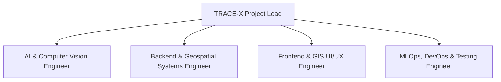

# TRACE-X: Engineering Skills & Competencies Matrix

**Document Code:** SKILLS-MATRIX-01  
**Target:** Hackathon Development Team & Technical Reviewers  
**Core Domain:** AI Perception, Geospatial Computing, Distributed Systems, GIS Engineering  

---

## 1. Hackathon Team Role Architecture

To successfully implement and defend TRACE-X across the 10 development phases outlined in Section 48 of the Master README, the engineering team requires specific domain competencies.

---

## 2. Detailed Competency Breakdown

### 2.1 Role 1: AI & Computer Vision Engineer (Perception Pipeline)
- **Primary Domain:** Object Detection, OCR, Image Enhancement, Deep Metric Learning.
- **Essential Technical Skills:**
  - *PyTorch / TorchVision:* Custom network forward passes, loss function formulation (ArcFace/Triplet Loss for Re-ID).
  - *Ultralytics YOLO (v8 / v11):* Model training, fine-tuning on custom license plate datasets, export to ONNX/OpenVINO.
  - *OpenCV 4:* Matrix filtering, morphological operations, Laplacian blur scoring, homography transformation (`cv2.getPerspectiveTransform`, `cv2.warpPerspective`).
  - *PaddleOCR / CRNN:* Character recognition inference, CTC beam search decoding, probability matrix extraction.
  - *Multi-Frame Fusion Logic:* Writing character consensus algorithms combining voting, quality weights, and Levenshtein metrics.
- **Key Deliverables:** Vehicle detector, plate detector, IQA module, conditional enhancement filters, Re-ID embedding extractor.

### 2.2 Role 2: Backend & Geospatial Systems Engineer (Data & Intelligence Layer)
- **Primary Domain:** Async Microservices, Spatial SQL, Graph Algorithms, Event Processing.
- **Essential Technical Skills:**
  - *FastAPI & Python AsyncIO:* Building high-throughput REST endpoints, Pydantic schemas, dependency injection.
  - *PostgreSQL 16 & PostGIS:* Writing spatial SQL queries using `GIST` indexes, calculating geodesic distances with `ST_Distance(geography)`, clustering with `ST_ClusterDBSCAN`.
  - *NetworkX / Graph Algorithms:* Spatiotemporal graph construction, candidate camera pruning, Dijkstra shortest-path travel feasibility.
  - *Trajectory Engine Logic:* Implementing the multi-signal evidence fusion scoring formula:
    $$Score = w_1 S_{plate} + w_2 S_{reid} + w_3 S_{time} + w_4 S_{dir} + w_5 S_{road}$$
- **Key Deliverables:** REST APIs (`/api/cameras`, `/api/events`, `/api/vehicles/{plate}/history`, `/api/traffic`), database schemas, trajectory engine, watchlist alert dispatcher.

### 2.3 Role 3: Frontend & GIS UI/UX Engineer (Command Center Dashboard)
- **Primary Domain:** Modern Web Architecture, Cartographic Visualization, Real-Time Dashboards.
- **Essential Technical Skills:**
  - *React 18 & TypeScript:* State management (Zustand or React Context), modular component architecture.
  - *Leaflet / React-Leaflet & OpenStreetMap:* Rendering custom SVG markers with pulsing CSS effects, drawing dynamic color-coded polylines (Confirmed/Probable/Gap), turf.js spatial operations.
  - *Modern CSS & Glassmorphism:* Responsive layouts, dark-mode color token systems, smooth micro-interactions.
  - *Data Visualization (Recharts / Chart.js):* Building real-time traffic volume curves, modal split donuts, and interactive Origin-Destination grids.
- **Key Deliverables:** Live City Map view, Single-Plate Trajectory Tracker view, Macro Traffic Analytics view, Watchlist Alert modal, PDF export layout.

### 2.4 Role 4: MLOps, DevOps & Testing Engineer (Reliability & Simulation)
- **Primary Domain:** Docker Containerization, Synthetic Data Generation, Automated Testing.
- **Essential Technical Skills:**
  - *Docker & Docker Compose:* Multi-container orchestration (PostGIS, Backend API, Frontend Vite server).
  - *Data Simulation:* Writing Python scripts to generate realistic multi-camera trajectory test suites (Tests A through F: normal, blurred, partial plate, offline camera gap, cloned plate).
  - *Automated Evaluation:* Implementing benchmark scripts to compute mAP for detection, Character Error Rate (CER) for OCR, and MOTA/IDF1 for trajectory tracking.
  - *Security & Compliance:* Implementing JWT authentication, SHA-256 audit logging, and role-based access control.
- **Key Deliverables:** `docker-compose.yml`, test suites A–F, synthetic video/event generators, evaluation scripts.

---

## 3. Recommended 36-Hour Hackathon Execution Roadmap

| Milestone | Time Window | Focus Areas | Key Output |
| :--- | :--- | :--- | :--- |
| **Phase 1: Foundation** | Hours 00 – 06 | Database DDL, PostGIS setup, Docker environment, API scaffolding. | Working DB schema, basic FastAPI endpoints running. |
| **Phase 2: Perception** | Hours 06 – 14 | YOLO detection, PaddleOCR pipeline, IQA filters, Multi-frame fusion. | Working ANPR script processing video clips and printing high-confidence plates. |
| **Phase 3: Trajectory Engine**| Hours 14 – 22 | Event serialization, spatial graph solver, evidence scoring equation. | Trajectory reconstruction API connecting observations with Confirmed/Probable flags. |
| **Phase 4: GIS Dashboard** | Hours 22 – 30 | React frontend, Leaflet dark map, trajectory breadcrumbs, traffic charts. | Functional 4-view dashboard with real-time alert popups. |
| **Phase 5: Evaluation & Demo**| Hours 30 – 36 | Run Tests A–F, seed golden demo scenario, polish slide deck presentation. | Flawless end-to-end golden demo ready for jury evaluation. |
