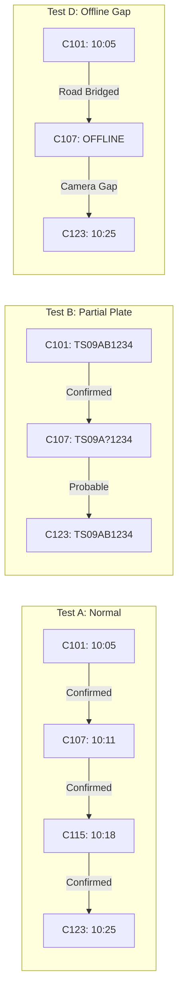

# TRACE-X: Testing Strategy, Trajectory Test Suites & Evaluation Metrics

**Document Code:** TEST-SPEC-01  
**Target Coverage:** Perception (ANPR/OCR), Trajectory Reconstruction, Traffic Analytics, Resilience  
**Reference:** Sections 49, 50, 51, 61 of the Master README  

---

## 1. ANPR / OCR Environmental Stress Test Matrix

The perception pipeline is evaluated across 8 environmental conditions to validate the $\ge 90\%$ accuracy threshold.

| Test ID | Condition | Simulated Impairment | Success Criteria |
| :--- | :--- | :--- | :--- |
| **ANPR-01** | High-Quality Daylight | Clean, frontal plate crop ($200 \times 60 \text{ px}$), clear illumination. | Exact character match ($100\%$), confidence $\ge 0.95$. |
| **ANPR-02** | Low Light / Night | Mean intensity $< 45$, noisy sensor grain. | CLAHE enhances contrast; Character Error Rate (CER) $\le 5\%$, confidence $\ge 0.85$. |
| **ANPR-03** | Severe Motion Blur | Laplacian variance $< 60$ (fast vehicle passing camera). | Multi-frame temporal fusion resolves ambiguous characters; CER $\le 8\%$. |
| **ANPR-04** | Rainy / Wet Surface | Water droplets, road reflections, specular headlight glare. | Adaptive thresholding suppresses glare; plate correctly localized and read. |
| **ANPR-05** | Steep Perspective Skew | Camera mounted at high pole, horizontal skew $> 25^\circ$. | 4-point homography unwarps crop to rectangular canonical form; CER $\le 5\%$. |
| **ANPR-06** | Mud / Dirt Splatter | 1 or 2 characters partially occluded by dust or dirt. | Multi-frame consensus fills missing glyph or labels character as `?` without hallucination. |
| **ANPR-07** | Font Non-Standardization| Customized font, varied spacing, embossed vs printed. | Character CTC decoding isolates alphanumeric glyphs; syntax rules validate format. |
| **ANPR-08** | Complete Unreadability | Plate missing, heavily folded, or completely covered. | System returns `plate_text: null`, status `UNREADABLE`, zero hallucinated characters; extracts Re-ID embedding. |

---

## 2. Trajectory Test Suites (Tests A through F)

The core cross-camera trajectory engine must pass six canonical scenarios:

### 2.1 Test A: Normal Multi-Camera Trajectory
- **Setup:** Target vehicle `TS09AB1234` (Black Yamaha motorcycle) traverses 5 consecutive cameras ($C_{101} \to C_{107} \to C_{112} \to C_{118} \to C_{123}$) over 20 minutes.
- **Expected Result:** Single continuous trajectory reconstructed; 4 links marked as `CONFIRMED`; overall confidence $\ge 0.94$; road distance matches GIS graph ($8.4 \text{ km}$).

### 2.2 Test B: Partial Plate Match
- **Setup:** Camera $C_{107}$ captures blurred crop `TS09A?1234` (confidence $0.61$), while $C_{101}$ and $C_{123}$ capture clear `TS09AB1234`.
- **Expected Result:** Trajectory engine does not drop the vehicle; link through $C_{107}$ marked as `PROBABLE`; reason flags "Partial plate + High Re-ID appearance similarity + Feasible transit time".

### 2.3 Test C: Completely Unreadable Plate
- **Setup:** At Camera $C_{115}$, plate is totally obscured. Vehicle is captured with `class: motorcycle`, `color: black`, Re-ID embedding $\mathbf{e}_{115}$.
- **Expected Result:** Engine uses Re-ID cosine similarity ($> 0.82$) with observations at $C_{107}$ and $C_{123}$; flags intermediate candidate as `PROBABLE (Visual Re-ID Match)`; zero false plate text created.

### 2.4 Test D: Offline Camera Gap
- **Setup:** Camera $C_{107}$ is disconnected / offline. Vehicle passes from $C_{101}$ at 10:05 to $C_{123}$ at 10:25.
- **Expected Result:** System detects $C_{107}$ is down; bridges route using shortest road network path; renders dotted orange line on GIS map with badge `CAMERA GAP (Probable Continuation)`.

### 2.5 Test E: False Visual Plate Similarity (Different Vehicle)
- **Setup:** Plate `TS09AB1234` (Black motorcycle) observed at $C_{101}$. Another vehicle with a dirty plate appearing like `TS09AB1234` (White bus) observed at $C_{103}$ 2 minutes later.
- **Expected Result:** Vehicle class and color contradiction severely penalizes match score ($S_{attr} = 0.0$); trajectory engine breaks the link and does not connect the bus to the motorcycle journey.

### 2.6 Test F: Impossible Travel Time (Cloned Plate Anomaly)
- **Setup:** Plate `TS09AB1234` detected at $C_{101}$ (Hyderabad North) at 10:00, and identical plate `TS09AB1234` detected at $C_{199}$ (Hyderabad South, 45 km away) at 10:05.
- **Expected Result:** Implied speed is $\frac{45 \text{ km}}{5 \text{ min}} = 540 \text{ km/h}$; trajectory engine prunes candidate link, separates trajectories, and fires a high-priority `CLONED PLATE / IMPOSSIBLE TRAVEL TIME ALERT`.

---

## 3. Macro Traffic Analytics Validation Suite

| Metric | Verification Test | Pass Criterion |
| :--- | :--- | :--- |
| **Volume Accuracy** | Compare automated vehicle count vs manual ground truth on a 1-hour test video clip. | Error rate $\le 3\%$. |
| **Speed Estimation** | Compare radar/GPS ground-truth vehicle speed with $v_{est} = \frac{Dist}{\Delta t}$. | Error margin $\le \pm 5 \text{ km/h}$ over links $\ge 1 \text{ km}$. |
| **Congestion Threshold** | Inject 1,200 simulated vehicles into a 2-lane road corridor over 15 minutes. | System flags corridor status as `SEVERE CONGESTION (RED)` within 60 seconds. |
| **OD Matrix Symmetry** | Verify that zonal trip counts in the OD matrix equal the sum of departed and arrived trips. | Matrix consistency check passes ($100\%$). |

---

## 4. Formal Evaluation Metrics

$$\text{Character Error Rate (CER)} = \frac{S + D + I}{N}$$
*(where $S$ = substitutions, $D$ = deletions, $I$ = insertions, $N$ = total ground truth characters)*

$$\text{IDF1 (Identification F1-Score)} = \frac{2 \cdot IDTP}{2 \cdot IDTP + IDFP + IDFN}$$
*(measures cross-camera trajectory identity persistence over time)*

- **mAP@0.50:** $\ge 0.92$ on vehicle and plate bounding box detection.
- **Plate Recognition CER:** $\le 0.05$ (equivalent to $> 95\%$ character accuracy).
- **Single-Plate Query Latency:** $< 500 \text{ ms}$ for 10,000 events; $< 1.0 \text{ s}$ for 100,000 events.
- **Memory Footprint:** $< 2.5 \text{ GB}$ VRAM during multi-stream prototype demo.
