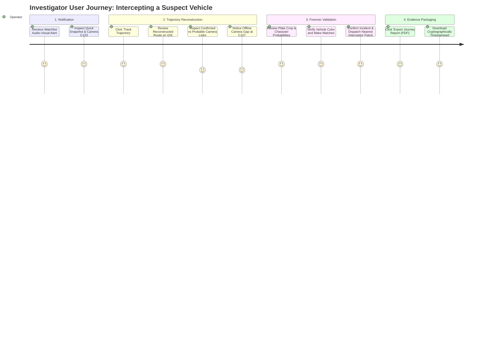

# TRACE-X: UI/UX Design System & Dashboard Specification

**Document Code:** UI-UX-SPEC-01  
**Aesthetic Style:** Cyber-Intelligence Command Center (Dark Mode Default)  
**Primary Users:** Traffic Police Operators, Dispatchers, Forensic Investigators  

---

## 1. Visual Design Philosophy & Aesthetics

TRACE-X is engineered for 24/7 mission-critical operations rooms where high visual noise causes cognitive fatigue. The interface employs a **Sleek Cyber-Dark Aesthetic** characterized by:
- Deep obsidian and charcoal background surfaces that minimize eye strain in dim control rooms.
- High-contrast neon accents (Cyan, Emerald, Amber, Crimson) dedicated exclusively to functional state signaling.
- Monospaced typography for license plates, timestamps, and GPS coordinates to prevent reading errors.
- Glassmorphic panels with subtle backdrop blurs (`backdrop-filter: blur(12px)`) and crisp borders (`1px solid rgba(255,255,255,0.08)`).

---

## 2. Design Tokens & Visual Hierarchy

### 2.1 Color Palette
```css
:root {
  /* Backgrounds */
  --bg-primary: #07090E;        /* Deep obsidian space */
  --bg-secondary: #0D121F;      /* Surface containers / sidebar */
  --bg-tertiary: #141B2D;       /* Card surfaces & modals */
  --bg-glass: rgba(13, 18, 31, 0.75);

  /* Borders & Dividers */
  --border-subtle: rgba(255, 255, 255, 0.08);
  --border-active: rgba(0, 242, 254, 0.4);

  /* Functional Brand Colors */
  --cyan-glow: #00F2FE;         /* Primary brand accent */
  --blue-accent: #4FACFE;       /* Secondary actions & interactive links */

  /* Trajectory & Status Signals */
  --status-confirmed: #00E676;   /* Confirmed Trajectory Link / Normal Flow (Green) */
  --status-probable: #FFD600;    /* Probable Trajectory Link / Moderate Traffic (Yellow) */
  --status-gap: #FF9100;         /* Camera Gap / Offline Camera (Orange) */
  --status-alert: #FF1744;       /* Watchlist / Route Anomaly / Congestion (Crimson) */

  /* Text & Typography */
  --text-primary: #FFFFFF;
  --text-secondary: #94A3B8;
  --text-muted: #64748B;
  --font-ui: 'Inter', system-ui, -apple-system, sans-serif;
  --font-mono: 'JetBrains Mono', 'Fira Code', monospace;
}
```

### 2.2 Typography Rules
- **Headings & Metric Displays:** `Inter`, font weights 600–700, tracked tight (`letter-spacing: -0.02em`).
- **License Plate Strings:** Always uppercase `JetBrains Mono`, bold, enclosed in an embossed high-contrast plate pill:
  ```css
  .plate-pill {
    font-family: var(--font-mono);
    font-weight: 700;
    letter-spacing: 0.12em;
    background: #FFD700;
    color: #000000;
    padding: 3px 8px;
    border-radius: 4px;
    border: 1.5px solid #000000;
    display: inline-block;
  }
  ```

---

## 3. Four Core Dashboard Views

```text
┌────────────────────────────────────────────────────────────────────────┐
│  TRACE-X  [LIVE CITY MAP]  [VEHICLE SEARCH]  [TRAFFIC ANALYTICS]  [ALERTS]│
└────────────────────────────────────────────────────────────────────────┘
```

### 3.1 View 1: Live City Map
The operational default view displaying an interactive GIS map of all monitored camera sectors.
- **Map Canvas:** Dark Matter cartographic base layer (CartoDB Dark).
- **Camera Pins:**
  - Online camera: Glowing green dot with pulse animation.
  - Camera with recent alert: Flashing crimson dot.
  - Offline camera: Grayed icon with an amber warning badge.
- **Traffic Congestion Overlay:** Polylines along major arterial corridors colored by current flow index (Green $> 40 \text{ km/h}$, Yellow $20 - 40 \text{ km/h}$, Red $< 20 \text{ km/h}$).
- **Floating Live Feed Drawer:** Collapsible sidebar showing a live stream of recently recognized vehicle events (plate, thumbnail, confidence).

### 3.2 View 2: Single-Plate Trajectory Tracker
Forensic search workspace allowing investigators to reconstruct a vehicle's chronological journey.
- **Search Header:**
  - Input field for license plate text (with autocomplete from recent events).
  - Date & Time range selector (e.g., Past 1 Hour, Past 24 Hours, Custom).
  - Vehicle class and color filter chips.
- **Journey Timeline & Breadcrumb Path:**
  - Left panel: Chronological list of camera detections ($C_{101} \to C_{107} \to C_{115} \to C_{123}$).
  - Each item displays: Camera ID, Road Name, Timestamp, Vehicle Thumbnail, Plate Crop, and Match Confidence Badge.
- **GIS Trajectory Rendering:**
  - Solid Green Polyline: **CONFIRMED** link (plate match $> 0.85$ + valid road link).
  - Dashed Yellow Polyline: **PROBABLE** link (partial plate or Re-ID match + time feasibility).
  - Dotted Orange Polyline: **CAMERA GAP** (interpolated route across unmonitored road or offline camera).
- **Evidence Card:** Clicking any camera pin on the trajectory opens a detailed forensic inspection modal showing the Laplacian blur score, character confidence breakdown, and speed estimate.

### 3.3 View 3: Macro Urban Traffic Analytics
Macro-level overview designed for traffic controllers and urban planning authorities.
- **Top KPI Cards:**
  1. *Vehicles Tracked Today:* (e.g. `248,910` with $+4.2\%$ vs. yesterday).
  2. *Average City Transit Speed:* (e.g. `34.8 km/h`).
  3. *Active Bottlenecks / Congested Corridors:* (e.g. `5 Hotspots`).
  4. *Pending Watchlist Alerts:* (e.g. `2 Critical`).
- **Analytics Charts:**
  - *Hourly Volume Curve:* Multi-line area chart showing peak hour distribution (Morning peak 08:30–10:30, Evening peak 17:30–20:00).
  - *Vehicle Modal Distribution Donut:* Modal split (42% Two-wheelers, 36% Cars, 12% Autos, 10% Commercial Trucks/Buses).
  - *Origin-Destination (OD) Matrix Grid:* Heatmap matrix showing trip volume between urban zones ($A \to B, A \to C, B \to D$).

### 3.4 View 4: Alerts & Watchlist Operations
Tactical intervention hub for blacklisted and anomalous vehicles.
- **Watchlist Manager:** Admin table to add target plates, upload court/police warrants, and set priority tiers (`CRITICAL`, `HIGH`, `MONITOR`).
- **Live Alert Stream:** High-priority cards popping in real-time with an audible alarm tone and instant GPS snapshot.
- **Human-in-the-Loop Validation:**
  - Two primary action buttons: `[CONFIRM INTERCEPTION]` or `[DISMISS / FALSE POSITIVE]`.
  - Input field to attach a formal police FIR / Case File ID to the event record.
- **Report Generator:** One-click export button generating a comprehensive, court-admissible PDF forensic journey summary with MD5 hash integrity verification.

---

## 4. User Journey Flowchart



---

## 5. Accessibility & Human Factors

- **WCAG 2.1 AA Compliance:** High contrast ratio ($\ge 7:1$ for all text against dark surfaces).
- **Color-Blind Safe Mode:** Trajectory status lines support both distinct colors AND distinct stroke patterns (Solid = Confirmed, Dashed = Probable, Dotted = Gap).
- **Keyboard Shortcuts:**
  - `/`: Quick focus on plate search bar.
  - `Space`: Pause/Play live map event streaming.
  - `Esc`: Close open modal/drawer.
  - `Ctrl + P`: Print/Export active journey report.
